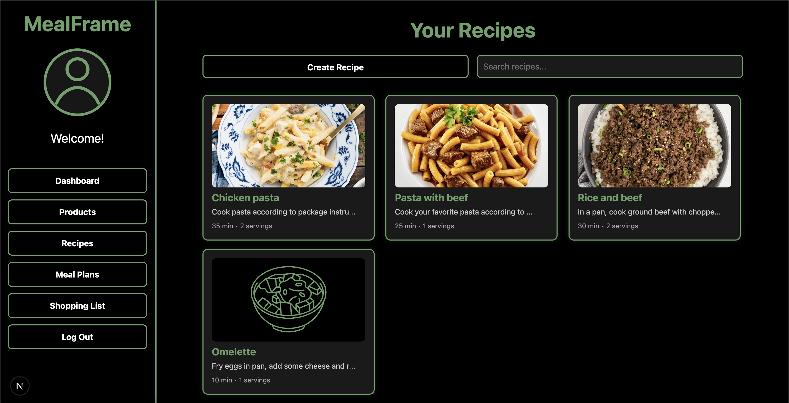

# MealFrame
MealFrame is a full-stack meal planning application with features like meal organization, 
macro tracking, and grocery management. App was built for Taltech C# Webapps + JS course.

Goal was to learn and implement a clean, layered architecture to ensure long-term maintainability and scalability.

## Tech Stack
| Layer          | Primary Tech                                           |
|----------------|--------------------------------------------------------|
| **Frontend**   | **React / Next.js**   TypeScript, CSS + Bootstrap   |
| **Backend**    | **C# /.NET 9**                                         |
| **Data**       | PostgreSQL                                             |

---
## Key Features
- **Meal Planner** — daily meal plan is automatically displayed on the dashboard.
- **Macro Tracker** — real‑time macros & calorie overview pinned to the dashboard.
- **Smart Grocery List** — generate shopping lists in few clicks based on your meal plans.
- **Layered Permissions** — JWT auth API access and protected Next.js routes.
- **Clean Architecture** — strict domain‑application‑infrastructure separation for testability.

---
## Design Walk‑through
Below are **live screenshots** taken from the current build. Each highlights a specific UX goal.

| Screen | Preview | Highlights                                                                                                |
|--------|---------|-----------------------------------------------------------------------------------------------------------|
| **Authentication** |  | Clean landing page with auth, email/password, and custom background.                                      |
| **Dashboard** |  | Instant macro summary, upcoming meals, and shorts cuts to today's recipes.                                |
| **Product Catalog** |  | Overview of all Products. Infinite scroll, user friendly design and search functionality.                 |
| **Recipes** |  | Overview of all Recipes. Infinite scroll, user friendly design and search functionality.                  |
| **Meal Plans** |  | Overview of all meal plans filtered by date. Search function and buttons for creation and detailed view.  |
| **Shopping List** |  | Shopping List generation based on selected meal plans. Supports category grouping and check boxing items. |
